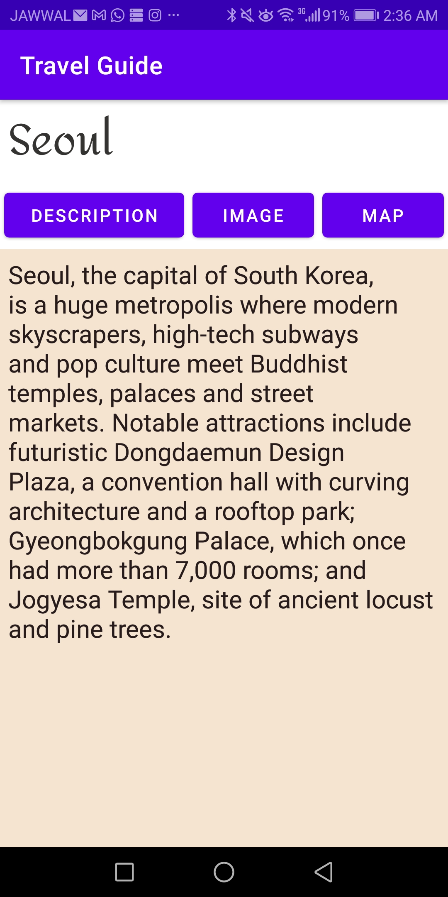

 <h1>Travel Guide Application</h1>
  
Welcome to the Travel Guide Application repository! This project aims to develop an application that serves as a comprehensive travel guide, providing users with detailed information about various travel destinations.

  <h2>Features</h2>
  <ul>
    <li>User Registration: Users are required to sign up with their email address and password to access the application.</li>
    <li>Travel Destination Listings: The application provides a list of possible travel destinations, including essential information about each location.</li>
    <li>Personalized Favorites: Registered users can create and manage their own collection of favorite travel destinations.</li>
    <li>REST Integration: The application retrieves all the necessary travel destination information through REST APIs.</li>
    <li>Destination Details: Each travel destination includes details such as city name, country, continent, longitude and latitude coordinates, a brief description, living costs, and a featured image URL.</li>
  </ul>

  
  
  
  
  

